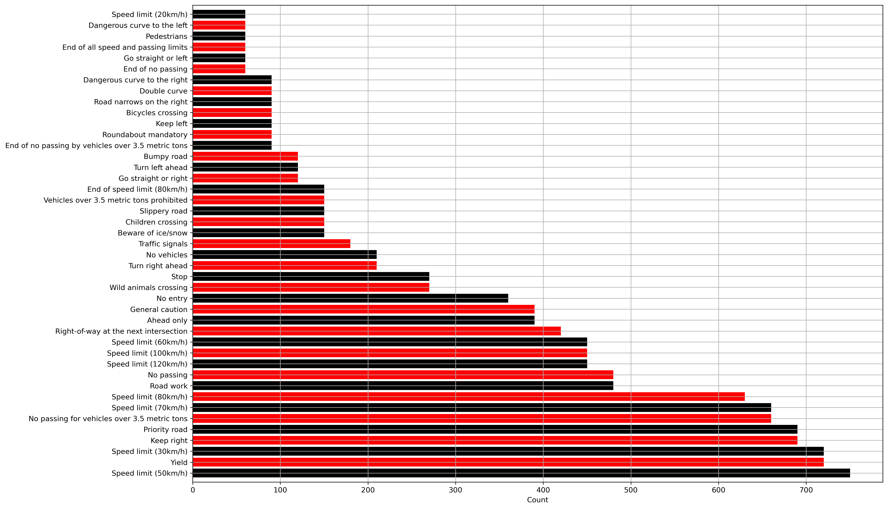
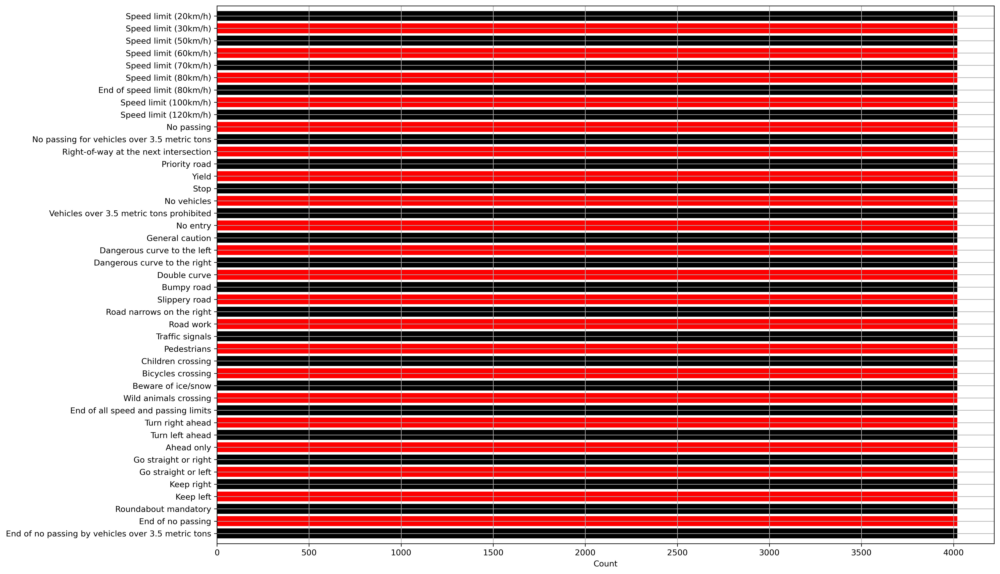
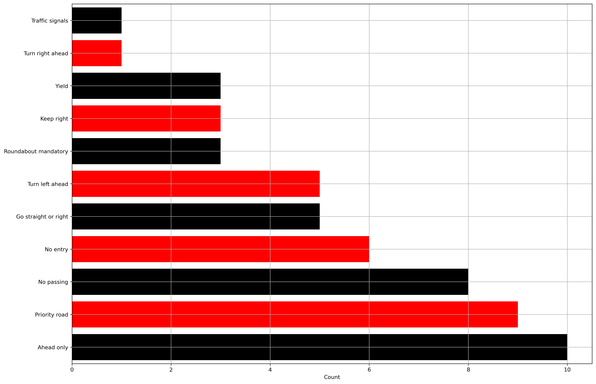
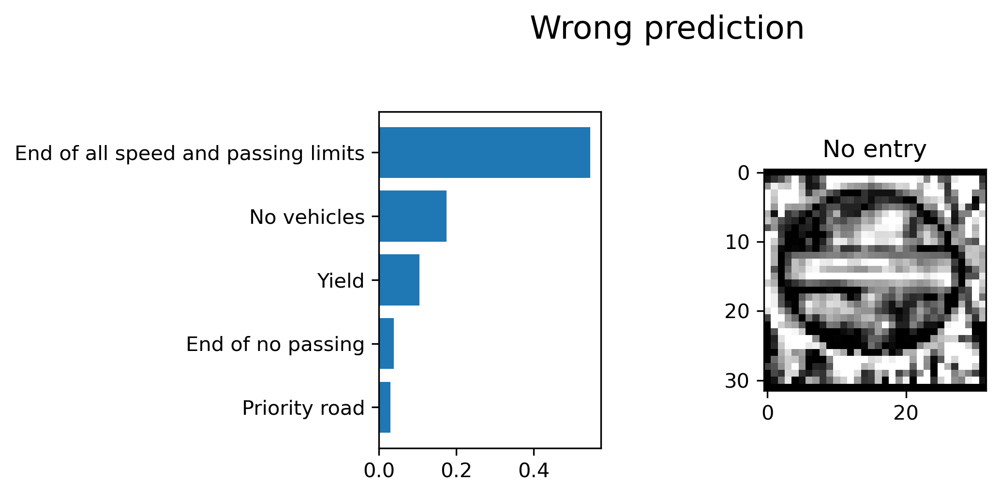

# **Traffic Sign Recognition** 

## Writeup

---

The goals / steps of this project are the following:
* Load the data set (see below for links to the project data set)
* Explore, summarize and visualize the data set
* Design, train and test a model architecture
* Use the model to make predictions on new images
* Analyze the softmax probabilities of the new images
* Summarize the results with a written report


<table class="image">
<caption align="bottom">Fig.1 - Some of the images of the German Traffic Sign dataset used for this project.</caption>
<tr>
    <td>
        <a name="15sings"> </a>
    </td>
</tr>
</table>


## Rubric Points
### Here I will consider the [rubric points](https://review.udacity.com/#!/rubrics/481/view) individually and describe how I addressed each point in my implementation.  

---
### Writeup / README

#### 1. Provide a Writeup / README that includes all the rubric points and how you addressed each one. You can submit your writeup as markdown or pdf. You can use this template as a guide for writing the report. The submission includes the project code.

You're reading it! And here is a link to my [project code](https://github.com/GiorGio82/P3-Traffic-Sign-Classifier/blob/master/Traffic_Sign_Classifier.ipynb)

The html that shows the execution of the entire code is called `Traffic_Sign_Classifier.html` and it is available [here](https://github.com/GiorGio82/P3-Traffic-Sign-Classifier/blob/master/Traffic_Sign_Classifier.html)

### Data Set Summary & Exploration

#### 1. Provide a basic summary of the data set. In the code, the analysis should be done using python, numpy and/or pandas methods rather than hardcoding results manually.

The function `print_stats` takes the features and labels as input and prints some basic dataset stats on screen. 
The datasets given as input for this project are based on the German Traffic sign dataset that contains color images (RGB) each with size 32x32. The output of the function `print_stats` is as follows:

```
Stats for the Training dataset
---------------------
Number of examples = 34799
Image data shape = (32, 32, 3)
Number of classes = 43
---------------------
Stats for the Validation dataset
---------------------
Number of examples = 4410
Image data shape = (32, 32, 3)
Number of classes = 43
---------------------
Stats for the Testing dataset
---------------------
Number of examples = 12630
Image data shape = (32, 32, 3)
Number of classes = 43
---------------------
```

The printout shows that the dataset has 43 classes.


#### 2. Include an exploratory visualization of the dataset.

A simple exploratory visualization of the data set uses an horizontal bar chart. Each plot shows the distrbution of classes, sorted by class sizes. The different plots indicate that the training data set is relatively unbalanced. For example [figure 2](#train_orig_distrib) indicates that some classes count as little as 180 images while the class with most of the images counts 2010 images. [Fig. 3](#valid_distrib) and [Fig. 4](#test_distrib) show the same unbalance distribution for the other datasets (validation and testing). The plots are drwan using the function `plot_sign_count_bar`.


<table class="image">
<caption align="bottom">Fig.2 - Traffic sign class distribution of the images of the training dataset.</caption>
<tr>
    <td>
        <a name="train_orig_distrib">  </a>
    </td>
</tr>
</table>

<table class="image">
<caption align="bottom">Fig.3 - Traffic sign class distribution of the images of the validation dataset.</caption>
<tr>
    <td>
        <a name="valid_distrib">  </a>
    </td>
</tr>
</table>


<table class="image">
<caption align="bottom">Fig.4 - Traffic sign class distribution of the images of the test dataset.</caption>
<tr>
    <td>
        <a name="test_distrib">  </a>
    </td>
</tr>
</table>


### Design and Test a Model Architecture

#### 1. Describe how you preprocessed the image data. What techniques were chosen and why did you choose these techniques? Consider including images showing the output of each preprocessing technique. Pre-processing refers to techniques such as converting to grayscale, normalization, etc. (OPTIONAL: As described in the "Stand Out Suggestions" part of the rubric, if you generated additional data for training, describe why you decided to generate additional data, how you generated the data, and provide example images of the additional data. Then describe the characteristics of the augmented training set like number of images in the set, number of images for each class, etc.)

As a first step, I decided to read the original article from [LeCun](http://yann.lecun.com/exdb/publis/pdf/sermanet-ijcnn-11.pdf) because to me converting traffic signs grayscale sounded counterintuitive. In the paper, the authors share my initial doubts but show empirically why grayscale images boost the model performance. Therefore I appy convert all images to grayscale. To convert the datasets to grayscale I used the function `cv.cvtColor(image, cv.COLOR_BGR2GRAY)` from opencv that was already used in previous projects. An example of transformation from RGB to grayscale is shown in the first two figures from the left of the top row of [Fig.7](#preprocessing_one_image). 

**Histogram equalization** The first pre-processing step is applying **histogram equalization** to all images to improve their contrast and visibility. To do so I have used the openCV class [CLAHE](https://docs.opencv.org/master/d5/daf/tutorial_py_histogram_equalization.html). [Figure 5](#clahe_effect) shows a color image (on the left) that is particularly dark (the traffic sign is almost unrecognizable) next to the grayscale version and the same image after applying histogram equalization filter (right hand side). The function used to convert to grayscale and to apply histogram equalization to an image dataset is called `applyEqualizationAndGray`.

<table class="image">
<caption align="bottom">Fig.5 - Example of the effect of histogram equalization to one traffic sign that is particularly dark and hard to recognize. </caption>
<tr>
    <td>
        <a name="clahe_effect">  </a>
    </td>
</tr>
</table>

**Normalisation and centering** The second pre-processing step is **'pixel normalisation and centering'**. As learned in the classroom, pixel normalisation and centering around zero are essential pre-processing steps to help the model to learn. Normalisation makes sure that all the features of the dataset have similar range, while centering helps the optimiser search process. I tested different approaches for normalisation and centering and obtained the best results with a 'global normalisation'. That is, first I calculate both the mean and std of the entire dataset (hence the term 'global'), then I subtract the global mean from each pixel and finally I divide the result by the global std. The centering and normalisation process are done by the function `normalise_input`.

**Data augmentation**
I decided to generate additional data to help the training model to be more generalized (able to predict new unseen images with higher accuracy). In fact, if the network is trained with a larger and more heterogeneous dataset, its validation and testing performance should improve by mitigating the effect of overfitting. When I first trained the network described below using the original training dataset, the training process provided overfitted results (training accuracy higher than validation accuracy). Since [overfitting can be contrasted in different ways](https://towardsdatascience.com/deep-learning-3-more-on-cnns-handling-overfitting-2bd5d99abe5d) such as data augmentation and introducing dropout I explored both. 

My first thought was to augment the traning data to balance the distribution of the dataset so that all classes have equal size (equal to the largest class of the original set). Secondly, when the dataset is balanced, I can use the same augmentation function to generate additional pictures so that the entire dataset size is increased by a given percent. To generate fake images I tried different methods and pre-processing functions from the [imgaug](https://github.com/aleju/imgaug) and from openCV libraries. I also made sure that the new fake images added to the augmented datasets were not a duplicate of an existing image (so that the network trains on unique images only).

To find out what preprocessing filters I should use for augmentation, I tested different combinations from the many available in the imgaug library, generated new datasets of different sizes and run the model again and again. The final version of function `augment` takes 5 inputs: (1) a table that indicates what classes need to be balanced (depending on their original class size), (2) the dataset to augment, (3) the corresponding array of labels, (4) the sequence of imgaug filters to apply and (5) the augmentation factor in percent, where 0 means 'only balancing the classes, no additional augmenting' and 100 means 'balance all classes and augment by 100%, that is double the size of each class'. For example with `augment_factor = 100`, a class with 180 images (the smallest class in the original dataset), gets balanced to the largest class first (that has 2010 images) and then it is also doubled so that the total number of unique images of the class will be 4020. With `augment_factor = 100`, all classes will have 4020 images as shown in the image below:

<table class="image">
<caption align="bottom">Fig.6 - Distribution of the training dataset after balancing and augmenting each class. All classes have now equal size and they all count 4020 images. </caption>
<tr>
    <td>
        <a name="train_balanced_distrib">  </a>
    </td>
</tr>
</table>


The  `augment` function randomly selects a simple combination of one or two filters to apply to each image, it applies it and then it checks if the new fake image already exists in the dataset: if it already exists, the image is discarded and a new image is generated. I tried several different filter combinations and I observed that applying filters that altered the image "too much" resulted in poor learning performance. For example filters suchas MedianBlur, GaussianBlur, AverageBlur or AdditiveGaussianNoise altered the images so much that the model performed very poorly (probably also because of the poor choice of other hyperparameters). Also I decided not to flip the images. The final set of filters is shown in the code snipped below, it is very simple but it provides in good performance:

```
iaa.SomeOf((1, 2),
    [
        # crop images by -10% to 10% of their height/width
        sometimes(iaa.CropAndPad(
            percent=(-0.1, 0.1),
            pad_cval=(0, 255)
        )),
        sometimes(iaa.Affine(
            # scale between 80% and 120% of the image (per axis)
            scale={"x": (0.8, 1.2), "y": (0.8, 1.2)},
            # translate by -20 to +20 percent (per axis)
            translate_percent={"x": (-0.2, 0.2), "y": (-0.2, 0.2)}, 
            # rotate by -45 to +45 degrees
            rotate=(-45, 45), 
            # shear by -20 to +20 degrees
            shear=(-20, 20),  
        )),
    ],
    random_order=True
)
```

The [figure 7](#preprocessing_one_image) shows one (random) picture form the training dataset and several versions of it with different filters. The first image on the left is the original image and next to it there is its grayscale version. The remaining 7 images are  copies of the grayscale image where one specific filter was applied. The last image of the first row is the gray image scaled down by 50%. The first image on the left of the middle row is translated by 20% (on both axes), the second image is rotated by 45 degrees and the third is sheard by 20 degrees. The first figure on the bottom row is cropped and padded, the second shows the CLAHE histogram equilization and the last image is centered and normalised (to plot the image the distribution is shifted from [-1,1] to [0,1] with 0.5 mean). The images in [figure 7](#preprocessing_one_image) are process with at most one filter, the images in the augmented dataset can be processed either one or twice.  


<table class="image">
<caption align="bottom">Fig.7 - Pre-processing techniques used to augment the training dataset. </caption>
<tr>
    <td>
        <a name="preprocessing_one_image">   </a>
    </td>
</tr>
</table>

I tried out different values of `augment_factor` and I share two of them with this submission. The first is a dataset with augemtation factor 0 (that is, all classes have 2010 images) and the second with augmentation factor 100 (that is all classes have have 4020 images each).

The difference between the original data set and the two augmented datasets are mainly two: (1) the classes of the augmented datasets are balanced in terms of number of images and (2) the augmented datasets contain aritificial images that help generalizing the learning process. 

#### 2. Describe what your final model architecture looks like including model type, layers, layer sizes, connectivity, etc.) Consider including a diagram and/or table describing the final model.

The final model is a modified version of the the LeNet-5 implementation shown in the [classroom](https://classroom.udacity.com/nanodegrees/nd013/parts/fbf77062-5703-404e-b60c-95b78b2f3f9e/modules/6df7ae49-c61c-4bb2-a23e-6527e69209ec/lessons/601ae704-1035-4287-8b11-e2c2716217ad/concepts/d4aca031-508f-4e0b-b493-e7b706120f81) because I could achieve good results with that architecture (probably due to the wrong choice of hyperparameters).

Since the classroom was published, Google released the version 2 TensorFlow. I decided to spend some time learning about the differences between TF1 and TF2 because almost all the resources and documentations I found online were focusing on TF2. This learning process was not trivial for me but I implemented the entire model with TF2 (version 2.4.1) and Keras.

The current implementation uses five hidden layers, three convolutional layers with increasing depth (I obtained the best results with depths=[32,64,128]) and two fully connected layers before the output layer. The final model is the result of an extensive exploration of small changes starting from the LeNet-5 model seen in the classroom. Since I could not reach reasonable results with the initial network I started adding additional layers and tried out different hyperparameters configurations. The space of exploration for the convolutional layers consisted in varying the depth, the kernel size and the strides. For the dense layers, I focused on chainging the number of elements.
Furthermore, I tried different values of pool size for the max pooling processes.

To contrast the effects of overfitting, (together with data augmentation) I introduced dropout as regularization method but decided to apply it only to the fully connected layers, that is layer 4 and layer 5 (and not to the convolutional layers). The best results are obtained with p4=0.3 and p5=0.2.

The current network has a total number of trainable parameters equal to 244,851

The final architecture is summarized in the table below and shown in [figure 8](#model_diagram)


| Layer                 |     Description                               | Details             |
|:---------------------:|:------------------:| :---------------------------------------------:|
| Input                 | Input              | 32x32x1 gray image                             |
| Layer 1               |Convolution 3x3     | depth:32, strides:1x1, padding:'valid', output:30x30x32|
| Layer 1               |Activation          | ReLU                                           |
| Pooling               |Max pooling         | stride:2x2, padding:'same', output:15x15x32    |
| Layer 2               |Convolution 3x3     | depth:64, strides:1x1, padding:'valid', output:13x13x64|
| Layer 2               |Activation          | ReLU                                           |
| Pooling               |Max pooling         | stride:2x2, padding:'same', output:7x7x64      |
| Layer 3               |Convolution 3x3     | depth:128, strides:1x1, padding:'valid', output:5x5x128|
| Layer 3               |Activation          | ReLU                                           |
| Pooling               |Max pooling         | stride:2x2, padding:'same', output:3x3x128     |
| Flatten               |output flatten      | 1152 elements                                  |
| Layer 4               |Dense, fully connected | output:120                                  |
| Layer 4               |Activation          | ReLU                                           |
| Layer 4               |Regularization      | Dropout, keep probability of 0.3               |
| Layer 5               |Dense, fully connected | output:84                                   |
| Layer 5               |Activation          | ReLU                                           |
| Layer 5               |Regularization      | Dropout, keep probability of 0.2               |
| Layer 5-out           | Output             | 43 outputs                             |
| Layer 5-out           |Activation          | Softmax                                           |

<table class="image">
<caption align="bottom">Fig.8 - Diagram of the network model. </caption>
<tr>
    <td>
        <a name="model_diagram">    </a>
    </td>
</tr>
</table>


#### 3. Describe how you trained your model. The discussion can include the type of optimizer, the batch size, number of epochs and any hyperparameters such as learning rate.

Since I used TF2, I trained the model using the builtin function `fit`. The function takes several inputs such as the training dataset, the labels (one-hot encoded), the number of epochs, the batch size, the validation dataset and some callbacks. The piece of code below shows how I call the function `fit`.  

```
history = model.fit(x=training_dataset_features, 
                    y=training_dataset_labels, 
                    epochs=training_epochs,
                    batch_size = training_batch_size,
                    validation_data=(X_valid, y_valid),
                    callbacks=active_callbacks,
                    verbose=1)
```

I found the usage of callbacks very useful and in particular I used two callbacks: the 'tensorboard' callback for using the tensorboard tool and the 'early stop' callback to stop the training process in case TF detects that the monitor performance parameters are not improving during the process. In my case, I decided to monitor the 'validation accuracy' and I set the patience to 10 epochs (the patientce indicaces the number of epochs without improvements before stopping the training process). I tried different patience values from 5 to 30 and decided that 10 was a good value for me. This is how I set the early stop callback:

`es_callback = tf.keras.callbacks.EarlyStopping(monitor='val_loss', patience=10)`

**Number of epochs**
Since I was not sure how many epochs I should use for training, I started with 20 and increased the value up to 200. If the early stop callback is enabled, I realized that the training process usually stops between epoch 20 and 40. 

**Batch size**
For the batch size I set the value to 512 because it provides faster results than 128 and it is still not too large for my local pc. 

**Optimizer and learning rate**
The model uses the Adam optimizer that was also mentioned in the classroom, I did not get the chance to try out other optimizers but I tried several learning rate values before getting back to the default value of 0.001. The snippet below show how I set the optimizer and how the model is compiled:

```
#Optimizer choice
opt = tf.keras.optimizers.Adam(learning_rate=0.001)

#Compile the model
model.compile(optimizer=opt,
            loss=categorical_crossentropy,
            metrics=['accuracy'])
```

For performance validation I used the provided validation dataset. Before passing the validation dataset to the fit function, the dataset is also processed using the histogram equalization (CLAHE) and the pixels are also normalized and centered. 

The same pre-processing is applied to the test dataset.

I add to the submission several datasets (where the images are already preprocessed) as pickle files. I do not add the original datasets. Specifically: 

```
training_file= '../traffic-signs-data/train_clahe_norm_no_aug.p'
training_file_aug_0= '../traffic-signs-data/train_CLAHE_norm_balanced_aug_factor_0.p'
training_file_aug_100= '../traffic-signs-data/train_CLAHE_norm_balanced_aug_factor_100.p'
validation_file= '../traffic-signs-data/valid_clahe_norm_no_aug.p'
testing_file= '../traffic-signs-data/test_clahe_norm_no_aug.p'
```

The file `train_clahe_norm_no_aug.p` contains the original training dataset after histogram equalization and normalisation. Therefore, the number of samples is still 34799, where each image has shape (32, 32, 1). 

The file `train_CLAHE_norm_balanced_aug_factor_0.p` contains the original training dataset after balancing the size of the 43 classes with image augmentation. Then each image is passed to the histogram equalization and normalisation filters. The number of samples is 86430, where each image has shape (32, 32, 1). 

The file `train_CLAHE_norm_balanced_aug_factor_100.p` contains the original training dataset after two steps of data augmentation: (1) balancing the size of the 43 classes with image augmentation and (2) each class is additionally doubled in size. Then each image is passed to the histogram equalization and normalisation filters. The number of samples is 172860, where each image has shape (32, 32, 1). 

The file `valid_clahe_norm_no_aug.p` contains the original validation dataset after histogram equalization and normalisation. Therefore the number of samples is still 4410, where each image has shape (32, 32, 1). 

The file `test_clahe_norm_no_aug.p` contains the original training dataset after histogram equalization and normalisation. Therefore the number of samples is still 12630, where each image has shape (32, 32, 1). 


#### 4. Describe the approach taken for finding a solution and getting the validation set accuracy to be at least 0.93. Include in the discussion the results on the training, validation and test sets and where in the code these were calculated. Your approach may have been an iterative process, in which case, outline the steps you took to get to the final solution and why you chose those steps. Perhaps your solution involved an already well known implementation or architecture. In this case, discuss why you think the architecture is suitable for the current problem.

Reaching validation accuracy higher than 0.93 was a relative long and iterative process that started with the TF1 implementation of the LeNet architecture seen in class. After making the very simple modifications to apply the same architecture to the new dataset with 43 classes, I quickly realized that moving to TF2 was a good idea also because of the simplicity of the integrated functions provided by TF2; the same architecture could be described in few lines as a sequential model. I experimented different hyperparameters with the LeNet architecture but I could not get good results even in case of relative large training sessions with 200 epochs. 

The best results for the validation accuracy I could achieve where around 88% (with training accuracy larger than 98%). High training accuracy and low validation accuracy seems to be an overfitting behaviour and therefore I focused on introducing both dropout and data augmentation. 

**Dropout**
Dropoout is a known regularization technique for reducing the effect of overfitting at the expense of higher training time. I decided to focus on applying dropout to the fully connected layers (layer 4 and layer 5). I explored several combinations of p4 (keep probability for layer 4) and p5 until I set to a value of p4=30% and p5=20%. Although the values I chose for p4 and p5 provide good results, a deeper investigation might show improved performance. High keep probabilities, say higher than 70% show high overfitting effects.

**Dataset augmentation**
The discovery of the imgaug library was an additional reason why I decided to port my code to TF2. In fact, before using the imgaug library I had implemented the image augmentation pipeline with OpenCV or PIL functions and the process was very slow and inefficient (especially when I wanted to generate thousands of images and also making sure that fake images were not duplicates of existing ones). I tried several combinations of filters from the imgaug library (starting from the examples provided by the imgaug authors) and tested the new datasets. 

Despite the combination of dropout and different augmented datasets I was not reaching very good performance, and therefore, I started exploring different architectures introducing aditional layers. Adding a third convolutional layer was one of the first steps I tried. With three convolutional layers I explored different sets of dephts such as constant depth for all layers, decreasing depth, increasing depth etc. The final values of [32,64,128] work well but I am confident enough that there are many other equally good combinations of depths that can also use less trainable parameters as in my case. In fact, eith the current design there are 244,851 trainable parameters which is probably an overkill for this project.

My general feeling, given the limited experience I have, is that there is always the need of spending quite some time to try out different parameter configurations before seing slighly improvements in the performance. 
I could have tried to use existing known architectures, but instead I spent a considerable amount of time with parameter exploration. 

The [figure 9](#epoch_accuracy_early_stop) shows my final results before submission. The figure is generated with Tensorboard, a great tool I discovered during the project work, and it shows three subplots for training and validation accuracy. The subplot on the left corresponds to the accuracy trend of the architecture using the original dataset (n=34799) of traffic sign (the images are processed with CLAHE and normalised). The figure in the middle shows the results for the balanced training set (n=86430) and the figure on the right shows the results of the balanced and augmented dataset (n=172860). The three subplots show very similar curves and the numerical results summarized in the table below confirm this impression. 

The [figure 10](#epoch_loss_early_stop) shows the training and validation loss trends for the same training process described above. The numerical results are summarized in the table below.

<table class="image">
<caption align="bottom">Fig.9 - Training and validation accuracy. </caption>
<tr>
    <td>
        <a name="epoch_accuracy_early_stop">    </a>
    </td>
</tr>
</table>

<table class="image">
<caption align="bottom">Fig.10 - Training and validation loss. </caption>
<tr>
    <td>
        <a name="epoch_loss_early_stop">    </a>
    </td>
</tr>
</table>


The table below shows the final accuracy and loss for the three different datasets. Once I reached validation accuracy above 93% (all datasets can achieve it), my goal was to obtain the highest test accuracy as possible. The table shows that when the model is trained with the balanced&augmented dataset, the final testing accuracy is 96.1%. 

Furthermore, I also wanted to explore what model would result in the best prediction with the unseen pictures I personally took in the street (I live in Germany). The same dataset, the balanced&augmented one, is the one that generalizes the most providing the best performance (accuracy and loss) for my personal dataset (accuracy of 94.4% and loss of 0.28). My own testing dataset has 54 samples and it is described in the next section. 


| Performance  |  Original training dataset |Balanced training dataset|Balanced&augmented (2x) training dataset  | 
|:-------------:|:------------------:| :---------------:|:-------------------------------:|
| Training accuracy               | 99.3   | 96.2 | 97.7|
| Training loss                  | 0.02   | 0.12 | 0.08|
| Validation accuracy             | 97.9   | 98.2 | 98.4|
| Validation loss                 | 0.08   | 0.09 | 0.1|
| Early stop epoch                | 29   | 21 | 23|
| Test accuracy                   | 95.4   | 95.5 | 96.1|
| Test loss                       | 0.2   | 0.2 | 0.17|
| Test accuracy with own pictures | 92.6   | 92.6 | 94.4|
| Test loss with own pictures     | 0.53   | 0.28 | 0.28|


My final model results were:
* training set accuracy of 97.7%
* validation set accuracy of 98.4% 
* test set accuracy of 96.1%
* test set accuracy with my own pictures of 94.4%

If an iterative approach was chosen:
* **What was the first architecture that was tried and why was it chosen?** 
I started using the LeNet-5 architecture as suggested. I ported it to TF2 and extended it with an additional convolutional layer because I was not able to reach the desired results
* **What were some problems with the initial architecture?**
The validation accuracy was not getting very high and I was experiencing overfitting, hence I introduced dropout and image augemntation
* **How was the architecture adjusted and why was it adjusted? Typical adjustments could include choosing a different model architecture, adding or taking away layers (pooling, dropout, convolution, etc), using an activation function or changing the activation function. One common justification for adjusting an architecture would be due to overfitting or underfitting. A high accuracy on the training set but low accuracy on the validation set indicates over fitting; a low accuracy on both sets indicates under fitting.**
I mainly epxlored the effects of dropout and adding one convolutional layer in the middle of the network. Of course there might be several additional strategies than mine. I experienced overfitting and also quite often underfitting for example when I was exploring different dropout values. 
Before using the CLAHE histogram equalization I tried the several histogram equalization functions in the imgaug library [summarized in this page](https://imgaug.readthedocs.io/en/latest/source/overview/contrast.html#allchannelshistogramequalization)
* **Which parameters were tuned? How were they adjusted and why?**
I tuned the two dropout keep probabilities, p4 and p5 to fight against overfitting. I tuned the learning rate but I could not see improvements so I reverted back to the default value. I tuned several parameters of the convolutional layers such as depths, kernel size (3x3 seems to work much better than 5x5 in most cases) and strides. I tuned the number of epochs (before ending up using the early stop callback).
* **What are some of the important design choices and why were they chosen? For example, why might a convolution layer work well with this problem? How might a dropout layer help with creating a successful model?**
As I learned in the class, convolutional layers work very well with image recognition and classification problems because of the property of translational invariance, which means that if we translate the features, the network will be able to detect the class that corresponds to the features [reference](https://towardsdatascience.com/translational-invariance-vs-translational-equivariance-f9fbc8fca63a#:~:text=Translational%20Invariance%20makes%20the%20CNN,result%20of%20the%20pooling%20operation.)
Therefore, I decided to add another convolutional layer to the LeNet network. 
Furthermore, I added two dropout lazers fight against overfitting. 

If a well known architecture was chosen:
* **What architecture was chosen?**
I did not use a known architecture, maybe simply adding another convolutional layer IS a known architecture, but if this is the case I do not know its name. I have just started with deeplearning. 
* **Why did you believe it would be relevant to the traffic sign application?**
I deliberately did not want to look for specific traffic sign architectures because I thought I could achieve good results on my own with this first assignment. I am confident there are many architectures in the literature for this specific problem. 
* **How does the final model's accuracy on the training, validation and test set provide evidence that the model is working well?**
The numerical result shown in the table above indicate that the model works sufficiently well but also shows that there is room for improvement and the need of exploring more.
 

### Test a Model on New Images

#### 1. Choose five German traffic signs found on the web and provide them in the report. For each image, discuss what quality or qualities might be difficult to classify.

The [figures 12](#Own_image_0) to [16](#Own_image_9) show five pictures from German traffic signs that I personally took in the street (since I live in Germany). Each image is accompanied by its CLAHE version and the normalised version. In total I have created a small dataset of 54 unique traffic sign images (split in 11 classes) and used them to test the architecture. The stats of the datasets are the follwoing:  

```
Stats for the own images dataset
---------------------
Number of examples = 54
Image data shape = (32, 32, 1)
Number of classes = 43
---------------------
```

Since the images I took had too much of an high resolution, I wrote seme functions to pre-process them: the function `preprocess_own_pictures` returns a dataset with images that are similar to the ones in the original German Traffic Sign dataset. The [figure 11](#Own_data_distrib) shows the distribution of the 54 images of the dataset.


<table class="image">
<caption align="bottom">Fig.11 - Distribution of my own datasets with 54 images split in 11 classes. </caption>
<tr>
    <td>
        <a name="Own_data_distrib">    </a>
    </td>
</tr>
</table>


<table class="image">
<caption align="bottom">Fig.12 - Priority road sign from my own dataset. </caption>
<tr>    
    <td>
        <a name="Own_image_0">   <figcaption>  </a>
    </td>
</tr>
</table>   
 
<table class="image">
<caption align="bottom">Fig.13 - Keep right sign from my own dataset. </caption>
<tr>    
    <td>
        <a name="Own_image_1">   <figcaption>  </a>
    </td>
</tr>
</table>  


<table class="image">
<caption align="bottom">Fig.14 - Randabout mandatory sign from my own dataset. </caption>
<tr>    
    <td>
        <a name="Own_image_2">   <figcaption>  </a>
    </td>
</tr>
</table>

<table class="image">
<caption align="bottom">Fig.15 - Ahead only sign from my own dataset. </caption>
<tr>    
    <td>
        <a name="Own_image_7">   <figcaption>  </a>
    </td>
</tr>
</table>

<table class="image">
<caption align="bottom">Fig.16 - Traffic signals sign from my own dataset. </caption>
<tr>    
    <td>
        <a name="Own_image_9">   <figcaption>  </a>
    </td>
</tr>
</table>


#### 2. Discuss the model's predictions on these new traffic signs and compare the results to predicting on the test set. At a minimum, discuss what the predictions were, the accuracy on these new predictions, and compare the accuracy to the accuracy on the test set (OPTIONAL: Discuss the results in more detail as described in the "Stand Out Suggestions" part of the rubric).


The model was able to correctly guess 51 of the 54 traffic signs, which gives an atesting accuracy on my own dataset of 94.4%. This is slighly lower than the accuracy on the test set of of 96.1%. The comparison with the test dataset is calculated with the following code:

```
results = loaded_model.evaluate(X_test, 
                         y_test, 
                         batch_size=128,
                         verbose=0)
print("test loss, test acc:", results)

results_own = loaded_model.evaluate(X_own_test, 
                         y_own_test,
                         verbose=0)
print("Own test loss, Own test acc:", results_own)
```
that produces the following result:

```
test loss, test acc: [0.17693284153938293, 0.9609659314155579]
Own test loss, Own test acc: [0.27811363339424133, 0.9444444179534912]
```
I observe that the both loss and accuracy for my own model are worse than the evaluation done with the test dataset (which has a population of n=12630).

More in detail, the function `eval_accuracy`, splits the correct and uncorrect evaluations as follows: 

`{'total': 54, 'correct': 51.0, 'wrong': 3, 'accuracy': 0.9444444444444444}`


#### 3. Describe how certain the model is when predicting on each of the five new images by looking at the softmax probabilities for each prediction. Provide the top 5 softmax probabilities for each image along with the sign type of each probability. (OPTIONAL: as described in the "Stand Out Suggestions" part of the rubric, visualizations can also be provided such as bar charts)

The code for making predictions on my final model is located towards the bottomo of the notebook. To generate the predictions and process the results I used the following functions:

```
predictions = loaded_model.predict(X_own_test,verbose=1)
details = pred_details(predictions,X_own_test,y_own_test,signnames)
```


The [figures 17](#Correct_pred_image_0) to [21](#Correct_pred_image_9) show the prediction accuracy of the network when fed with the selected five pictures from the dataset of own images. The table also shows the numerical values. Each picture is accompanied by the output of the softmax activation function for the top 5 possible predictions. All pictures are correctly predicted with very high certainty: the second best prediction is almost not visible in the bar chart.

| Sign (figure #)  |  Top prediction | 2nd prediction|3rd prediction| 4th prediction| 5th prediction| 
|:-------------:|:-------------:|:-------------:|:-------------:|:-------------:|:-------------:|
| Priority road (fig 17)| 1.0000000e+00   | 1.9700419e-15 | 1.8342218e-16|2.2566294e-17|4.0773817e-18|
| Keep right  (fig 18)| 9.9226952e-01   | 7.1921796e-03 | 4.6006267e-04|3.8725608e-05|1.8978346e-05|
| Randabout mandatory (fig 19)|9.9966168e-01 |2.2072853e-04| 4.8673264e-05 |4.0549839e-05| 2.1177562e-05|
| Ahead only (fig 20)|1.0000000e+00 |2.6600214e-08 |2.6679059e-09 |1.4949363e-09| 5.1465732e-10|
| Traffic signals (fig 21)|9.9980146e-01 |1.2454635e-04| 7.3347859e-05 |2.3706654e-07 |2.3087895e-07|


<table class="image">
<caption align="bottom">Fig.17 - Prediction accuracy for the "Priority road sign" from my own dataset. </caption>
<tr>    
    <td>
        <a name="Correct_pred_image_0">   <figcaption>  </a>
    </td>
</tr>
</table>

 
<table class="image">
<caption align="bottom">Fig.18 - Prediction accuracy for the "Keep right sign" from my own dataset. </caption>
<tr>    
    <td>
        <a name="Correct_pred_image_1">   <figcaption>  </a>
    </td>
</tr>
</table>  


<table class="image">
<caption align="bottom">Fig.19 - Prediction accuracy for the "Randabout mandatory sign" from my own dataset. </caption>
<tr>    
    <td>
        <a name="Correct_pred_image_2">   <figcaption>  </a>
    </td>
</tr>
</table>

<table class="image">
<caption align="bottom">Fig.20 - Prediction accuracy for the "Ahead only sign" from my own dataset. </caption>
<tr>    
    <td>
        <a name="Correct_pred_image_7">   <figcaption>  </a>
    </td>
</tr>
</table>

<table class="image">
<caption align="bottom">Fig.21 - Prediction accuracy for the "Traffic signals sign" from my own dataset. </caption>
<tr>    
    <td>
        <a name="Correct_pred_image_9">   <figcaption>  </a>
    </td>
</tr>
</table>


More interesting is the exploration on the three images that are not correctly predicted by the model, that is 
[figure 22](#Wrong_pred_image_23) where a "No entry" sign was predicted as a "Priority road" sign, [figure 23](#Wrong_pred_image_35) where another "No entry" sign was predicted as a "End of all speeds and passing limits" and [figure 24](#Wrong_pred_image_51) wherethe "Go straight or right" sign was predicted as an "Ahead only" sign.

All numerical values are summarized in the table below:

| Sign (figure #)  |  Top prediction | 2nd prediction|3rd prediction| 4th prediction| 5th prediction| 
|:-------------:|:-------------:|:-------------:|:-------------:|:-------------:|:-------------:|
| No entry (fig 22)| 9.8379159e-01 |1.6207857e-02 |1.8546235e-07 |1.7226644e-07 |6.1256536e-08|
| No entry  (fig 23)| 0.54557186 |0.17437021| 0.10472484| 0.03869934 |0.02921509|
| Go straight or right (fig 24)|9.5203978e-01 | 3.0644638e-02| 1.6842106e-02| 4.6105051e-04 |7.7392333e-06|

<table class="image">
<caption align="bottom">Fig.22 - The "No entry" sign was predicted as a "Priority road" sign. </caption>
<tr>    
    <td>
        <a name="Wrong_pred_image_23">   <figcaption>  </a>
    </td>
</tr>
</table>

The No entry sign in [fig 22](#Wrong_pred_image_23) was predicted as a priority road, this is very strange at first but then I realized that the original picture I took has a spray tag with a triangular shape on it (which is still visible on the gray image) and the model has probably detected that shape as an indicator of a priority sign shape.
 
<table class="image">
<caption align="bottom">Fig.23 - The "No entry" sign was predicted as a "End of all speeds and passing limits". </caption>
<tr>    
    <td>
        <a name="Wrong_pred_image_35">   <figcaption>  </a>
    </td>
</tr>
</table>  

The No entry sign in [fig 23](#Wrong_pred_image_35) was predicted as a End of all speeds and passing limits, but the model was very unsure about the prediction. Both first prediction and second choice are round traffic signs with a diagonal on it but I cannot see any diagonal shape on the sign. Furthermore, the No entry sign is not even in the top 5 predictions in this case. 

<table class="image">
<caption align="bottom">Fig.24 - The "Go straight or right" sign was predicted as an "Ahead only" sign. </caption>
<tr>    
    <td>
        <a name="Wrong_pred_image_51">   <figcaption>  </a>
    </td>
</tr>
</table>

The Go straight or right sign in [figure 24](#Wrong_pred_image_51) was predicted as an Ahead only sign. The two signs are quite similar and in this particular case the model might have discarded the right part of the sign.

### (Optional) Visualizing the Neural Network (See Step 4 of the Ipython notebook for more details)
#### 1. Discuss the visual output of your trained network's feature maps. What characteristics did the neural network use to make classifications?

